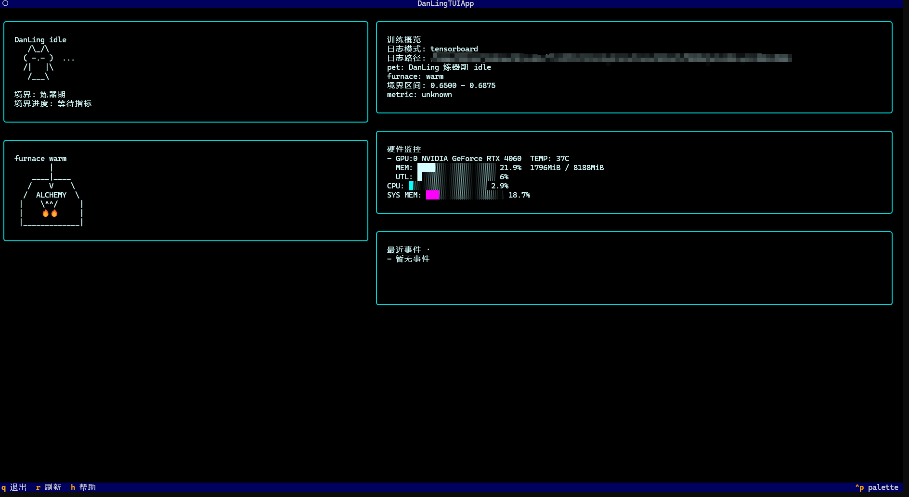
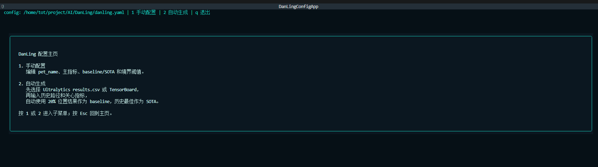

# DanLing（丹灵）

> 把训练日志和硬件指标翻译成一眼能看懂的终端训练状态。

**当前版本：v1.2.0** · **Python：3.10+** · **许可证：CC BY-NC-ND 4.0**

DanLing 是一个轻量的 Python CLI/TUI 工具。它读取训练日志和 GPU/NPU 状态，把 loss、mAP、显存、利用率这些数字解释成训练状态、宠物情绪、炼丹炉状态、修炼境界和诊断建议。

它不替代 TensorBoard、W&B、MLflow、Aim 或 ClearML，也不接管训练任务。DanLing 更适合放在 SSH 终端、训练脚本旁边、shell statusline、Claude Code status line 或本地演示流程中，帮你快速判断“训练现在怎么样”。

## 界面预览

### 全屏监控 TUI



### 配置 TUI



## 核心功能

| 功能 | 说明 |
| --- | --- |
| 训练日志读取 | 支持 Ultralytics `results.csv`、官方控制台 `.log/.txt`，可选支持 TensorBoard event |
| 状态解释 | 判断训练是否正常、变好、停滞、日志停更或出现 loss 异常 |
| 修炼境界 | 用 baseline/SOTA 或手动阈值，把指标映射到五个境界 |
| 诊断建议 | 提示 NaN/inf、loss 爆炸、长期无提升、显存风险、checkpoint 缺失等问题 |
| 硬件状态 | 读取 NVIDIA GPU、Ascend NPU、主机 CPU 和系统内存基础状态，失败时自动降级 |
| 终端展示 | 支持 Rich 面板、循环 watch、Textual 全屏 TUI、配置 TUI 和 statusline |
| 远程可视化 | 通过 SSH 密钥读取远程 `results.csv` 或官方 `.log/.txt`，并读取远程 NVIDIA GPU 状态 |
| 日志回放 | 可按行回放历史 CSV/TensorBoard scalar，便于演示和调试 |

## 快速启动

安装基础包：

```bash
pip install danling-pet
```

按需安装可选能力：

```bash
pip install "danling-pet[tui]"          # 全屏 TUI 和配置 TUI
pip install "danling-pet[tensorboard]"  # TensorBoard event reader
pip install "danling-pet[yaml]"         # PyYAML 配置解析
```

初始化配置（含数据源和路径，配置后 tui/watch 可不指定 PATH 和 --source）：

```bash
danling init
danling config tui
```

通过TUI可视化

```bash
danling tui
```

通过 SSH 可视化远程训练：

```bash
danling remote setup trainbox
danling remote hardware trainbox
danling remote status trainbox --config danling.yaml
danling remote tui trainbox --config danling.yaml
```

`remote setup` 会用 TUI 辅助填写 `user@host`、远程日志目录、数据源和 SSH 私钥路径，并提示执行 `ssh-copy-id -i <key>.pub user@host`。监控阶段强制使用 `ssh -i <key> -o BatchMode=yes`，不会等待密码输入；远程 GPU 状态默认通过 `nvidia-smi` 读取，也可以用 `remote hardware` 单独查看。远程监控支持 Ultralytics `results.csv` 和官方控制台 `.log/.txt`，长 epoch 训练建议选 `ultralytics-log`。

回放历史日志做演示：

```bash
danling simulate logs/ultralytics/results.csv logs/run --interval 2
```

更完整的上手流程见 [快速启动](快速启动.md) 和 [Getting Started](docs/getting-started.md)。

## v1.2.0 概览

v1.2.0 继续打磨“配置好就能看”的本地和远程训练监控体验：配置文件可以保存默认数据源和日志路径，配置 TUI 增加数据源页面，监控 TUI 的硬件区域也改成更直观的进度条展示。

| 类别 | v1.2.0 状态 |
| --- | --- |
| 数据源 | Ultralytics CSV 和官方 log/txt 可用；TensorBoard event 可选可用 |
| 展示方式 | Rich 面板、watch、statusline、Textual TUI 可用；TUI 展示日志模式、日志路径和硬件进度条 |
| 配置能力 | `danling init`、`danling config show`、`danling config tui` 可用；可配置默认 `source` 和 `data_path` |
| 诊断能力 | NaN/inf、loss 爆炸、无提升、日志停更、显存风险、低利用率、checkpoint 缺失 |
| 硬件读取 | NVIDIA 基础支持；Ascend 保守解析；Textual TUI 补充主机 CPU 和系统内存 |
| 远程监控 | `danling remote setup/hardware/status/watch/tui` 通过 SSH 密钥读取远程日志和 GPU；支持 profile 关联配置 |
| 当前限制 | 暂不支持 W&B/MLflow/Aim/ClearML 直连；暂无 Web Dashboard |

## 文档导航

| 文档 | 内容 |
| --- | --- |
| [快速启动](快速启动.md) | 最短安装、配置和运行路径 |
| [Getting Started](docs/getting-started.md) | 更完整的示例 run、配置和监控流程 |
| [Commands](docs/commands.md) | 命令表和常用参数 |
| [Configuration](docs/configuration.md) | `danling.yaml`、境界阈值和配置 TUI |
| [Readers](docs/readers.md) | CSV / Ultralytics log/txt / TensorBoard 数据源说明 |
| [State Model](docs/state-model.md) | 宠物情绪、修炼境界、炼丹炉状态和本地状态 |
| [Diagnostics](docs/diagnostics.md) | 诊断项和 `danling doctor` |
| [Hardware](docs/hardware.md) | NVIDIA / Ascend 硬件读取和降级策略 |
| [Development](docs/development.md) | 本地开发命令和模块边界 |
| [Release v1.2.0](docs/releases/v1.2.0.md) | v1.2.0 发布说明 |

## 开发

```bash
pip install -e ".[dev,tui,yaml,tensorboard]"
pytest
ruff check src tests
python -m build --no-isolation
```

## 许可与使用边界

本项目源代码公开，但当前采用 [CC BY-NC-ND 4.0](LICENSE)（署名-非商业性使用-禁止演绎 4.0 国际）许可。

- 允许在非商业场景中查看、复制、学习和分享原始版本。
- 允许在本地为学习、研究或个人使用修改代码。
- 不允许商业使用。
- 不允许对外分发修改后的版本。

商业授权、企业内部使用或二次分发需求，需要联系作者并获得单独书面许可。
